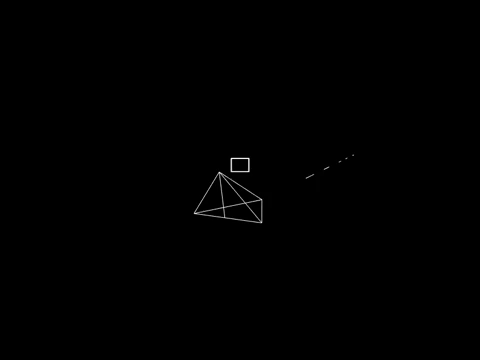

# LinearAlgebra
This application was programmed for the course "Linear Algebra" with as goal to learn basic linear algebra.
This program was created in February 2018 using C++ and SFML.
The code is unpolished and messy since this was programmed under time pressure.

## Gifs

### Camera movement

### Shooting

### Rotating around x-axis

### Rotating around y-axis

### Barrel rolls

## Controls
_*Q*_: Barrel roll left

*E*: Barrel roll right

*W*: Move ship up

*S*: Move ship down

*A*: Move ship left

*D*: Move ship right

*T*: Rotate ship around x-axis forward

*Y*: Rotate ship around y-axis left

*G*: Rotate ship around x-axis backwards

*H*: Rotate ship around y-axis right

*Left ctrl*: Reverse ship

*Left shift*: Accelerate ship

*Space*: Shoot

*Arrow up*: Move camera forward

*Arrow down*: Move camera backwards

*Arrow right*: Move camera right

*Arrow left*: Move camera left
